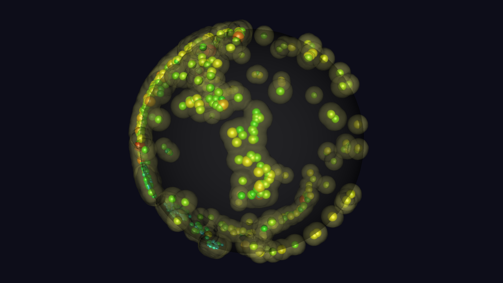

# Global Earthquake Scientific Visualization using VTK and ParaView Concepts

This project demonstrates a complete scientific visualization workflow using **Python**, **VTK**, and **ParaView concepts** to transform real-world earthquake data from the USGS into a professional 3D globe visualization.

It takes raw earthquake records containing latitude, longitude, depth, and magnitude, converts them into 3D Cartesian coordinates, and renders them as glyph-based seismic events on and beneath the Earth’s surface. The result is a visualization that makes global seismic patterns, tectonic boundaries, and earthquake clusters much easier to understand than a flat table of numbers.



## 🚀 Project Overview

The goal of this case study is to demonstrate an end-to-end scientific visualization pipeline:

1. **Data Ingestion**  
   Downloading recent earthquake data from the USGS earthquake feed.

2. **Preprocessing**  
   Converting spherical geographic coordinates `(latitude, longitude, depth)` into 3D Cartesian coordinates using Python and VTK-compatible data structures.

3. **Visualization Pipeline**  
   Building a multi-stage scientific visualization workflow where earthquake magnitude is mapped to glyph size and color, and seismic density is shown through a secondary contour layer.

4. **Rendering and Analysis**  
   Producing static renders and animation frames that reveal seismic hotspots and global tectonic patterns.

## 📊 Dataset

- **Source**: [USGS Earthquake Hazards Program](https://earthquake.usgs.gov/earthquakes/feed/v1.0/summary/all_month.csv)
- **Timeframe**: Past 30 days of earthquake activity
- **Attributes Used**: Time, Latitude, Longitude, Depth, Magnitude

## 🛠️ Technology Stack

- **Python 3**: Core scripting language for data processing and rendering workflow
- **VTK (Visualization Toolkit)**: Used for generating `.vtp` datasets and creating reproducible headless renders
- **Pandas**: Used for loading, filtering, and cleaning earthquake data
- **NumPy**: Used for numeric coordinate transformation
- **ParaView concepts**: Used as the conceptual basis for the scientific visualization pipeline

## 📂 Project Structure

```bash
SeismoVis/
├── README.md
├── requirements.txt
├── check_env.py
├── .github/
│   └── workflows/
│       └── update_viz.yml
└── paraview-earthquake-visualization/
    ├── requirements.txt
    ├── data/
    │   ├── earthquakes.csv
    │   └── earthquakes.vtp
    ├── scripts/
    │   ├── fetch_data.py
    │   ├── convert_to_vtk.py
    │   └── generate_renders.py
    ├── paraview/
    │   └── earthquake_pipeline.pvsm
    ├── renders/
    │   ├── earthquake_visualization.png
    │   └── frames/
    └── docs/
        └── workflow_explanation.md
```

Note: The actual project files live inside `paraview-earthquake-visualization/`.

## ⚙️ Installation and Usage

You can run this project in two ways.

### Option A: Run from the repository root

1.  **Install dependencies**
    ```bash
    pip install -r paraview-earthquake-visualization/requirements.txt
    ```

2.  **Fetch the latest earthquake data (optional)**  
    A recent CSV snapshot is already included in the repository, but you can fetch the latest USGS data with:
    ```bash
    python paraview-earthquake-visualization/scripts/fetch_data.py
    ```

3.  **Convert CSV data to VTK PolyData**
    ```bash
    python paraview-earthquake-visualization/scripts/convert_to_vtk.py
    ```
    This generates: `paraview-earthquake-visualization/data/earthquakes.vtp`

4.  **Generate headless renders**
    ```bash
    python paraview-earthquake-visualization/scripts/generate_renders.py
    ```
    This generates:
    - `paraview-earthquake-visualization/renders/earthquake_visualization.png`
    - `paraview-earthquake-visualization/renders/frames/frame_000.png` through `frame_029.png`

5.  **Create animation video (optional)**
    ```bash
    ffmpeg -framerate 10 -i paraview-earthquake-visualization/renders/frames/frame_%03d.png -c:v libx264 -pix_fmt yuv420p paraview-earthquake-visualization/renders/earthquake_animation.mp4
    ```

### Option B: Run from inside the project directory

```bash
cd paraview-earthquake-visualization
pip install -r requirements.txt
python scripts/fetch_data.py
python scripts/convert_to_vtk.py
python scripts/generate_renders.py
```

## 🔄 End-to-End Pipeline

The project follows this sequence:

```
USGS CSV feed
      ↓
scripts/fetch_data.py
      ↓
data/earthquakes.csv
      ↓
scripts/convert_to_vtk.py
      ↓
data/earthquakes.vtp
      ↓
scripts/generate_renders.py
      ↓
PNG render + animation frames
      ↓
(optional) ffmpeg
      ↓
MP4 animation
```

## 🧠 Scientific Reasoning

The visualization uses **glyphs** (spheres) to represent individual earthquake events in 3D space.

-   **Why glyphs?**  
    Each earthquake is a discrete point event, so glyphs are an effective way to represent them spatially while preserving event-level detail.
-   **Why map magnitude to size?**  
    Larger earthquakes are visually emphasized immediately, making high-energy events easier to detect.
-   **Why map magnitude to color?**  
    A color gradient provides a second visual encoding of intensity, reinforcing the meaning of the size mapping.
-   **Why convert to 3D Cartesian coordinates?**  
    Earthquake data is naturally expressed in geographic coordinates, but scientific visualization tools work best with explicit 3D points. Converting latitude, longitude, and depth into Cartesian coordinates allows the data to be placed correctly on and beneath a globe, revealing tectonic boundaries and depth structure in a physically meaningful way.
-   **Why include a density layer?**  
    A secondary contour-style density layer helps reveal regional clustering and seismic concentration, making large-scale patterns more readable.

## 📷 Outputs

The project produces:
- A high-resolution static render for portfolio or documentation use.
- A 30-frame orbital animation sequence.
- An optional MP4 animation encoded from the frame sequence.

## ⚠️ Notes

-   **Reliability:** The most reliable way to reproduce the project is through the Python scripts in `paraview-earthquake-visualization/scripts/`.
-   **Data:** A recent earthquake dataset is already included in the repository, so `fetch_data.py` is optional for first-time runs.
-   **Rendering:** Headless rendering depends on VTK offscreen/OpenGL support and may be environment-sensitive on some Linux, CI, or headless systems.
-   **State Files:** The ParaView state file in `paraview-earthquake-visualization/paraview/earthquake_pipeline.pvsm` should be treated as a conceptual reference for the visualization pipeline rather than the primary execution path.

## 📘 Workflow Documentation

For a deeper explanation of the methodology and visualization logic, see:  
[Workflow Documentation](paraview-earthquake-visualization/docs/workflow_explanation.md)

## ✅ What This Project Demonstrates

-   **Scientific data transformation** from geographic coordinates to 3D visualization-ready data.
-   **Use of VTK data structures** and rendering workflows.
-   **Reproducible script-based visualization** generation.
-   **Multi-stage visualization design** for geospatial scientific data.
-   **Clear communication of scientific patterns** through rendering and animation.
